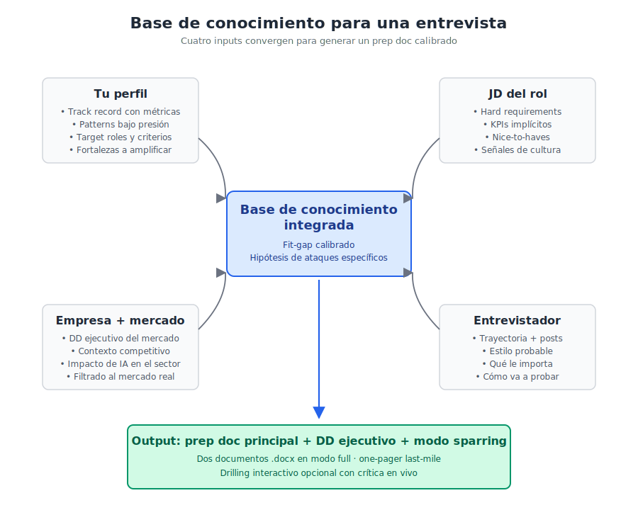

# full-interview-prep

Una skill para Claude que prepara entrevistas laborales de alto stakes con **investigación profunda sobre empresa y entrevistador**, **fit-gap calibrado al perfil del usuario**, y **modo sparring** — un entrenamiento simulado con un entrevistador hostil pero realista, calibrado a los patterns bajo presión específicos del usuario.

No es otro template de "10 preguntas para tu próxima entrevista". Es un framework metodológico que requiere trabajo previo de la persona para rendir.

---

## Descargar

**[Descargar la última versión (`.zip`)](https://github.com/martinjbellocq/full-interview-prep/releases/latest/download/full-interview-prep.zip)**

O entrar a la [página de Releases](https://github.com/martinjbellocq/full-interview-prep/releases) para ver el historial de versiones con sus changelogs.

> **No uses el botón verde "Code" → "Download ZIP"** que aparece arriba en este repo. Ese descarga todo el código fuente con un nombre incorrecto y la skill no va a poder instalarse en Claude.ai. Siempre descargá desde Releases (link de arriba).

Una vez descargado el `.zip`, seguí los pasos de [Instalación](#instalación) más abajo.

---

## Cómo funciona

La calidad del prep depende de cuatro inputs convergentes. Cuando los cuatro están bien levantados, la skill puede entregar análisis y sparring que valen la pena.



---

## Qué la hace distinta

La mayoría de prep guides de entrevistas operan en un nivel genérico: preguntas típicas, respuestas tipo, plantillas STAR, lista de "smart questions" que sirven para cualquier rol. Esta skill apunta a otro nivel:

- **Investigación real, no superficial.** Sobre el entrevistador (mínimo 3 fuentes públicas distintas o se declara que no hay huella). Sobre la empresa (DD ejecutivo tipo investment memo, filtrado al mercado/región/unidad de la entrevista, con sección obligatoria sobre cómo IA está afectando al sector).
- **Calibrado al usuario.** Antes de generar nada, la skill construye (o lee) un perfil del usuario que incluye no solo track record y target, sino especialmente **los patterns bajo presión** del usuario en entrevistas — los comportamientos específicos que aparecen bajo estrés y degradan performance.
- **Modo sparring.** Para cada gap del fit, genera un ataque calibrado al estilo del entrevistador, identifica la respuesta defensiva que el usuario probablemente va a dar bajo presión (basado en sus patterns documentados), y entrega un frame mental de defensa (NO un script literal).
- **Output dual.** En modo full, la skill entrega **dos documentos .docx separados**: el prep doc principal con todo el análisis y el sparring, y un DD ejecutivo de la empresa tipo investment memo como anexo. Esto permite leer el prep en una sentada y el DD por separado cuando hay tiempo de profundizar.
- **Quality gate explícito.** Cero hallucination: si la búsqueda no encontró info, lo declara. Sin filtro de mercado, no avanza. Si el sparring no encontró weak spots reales, lo dice.

---

## Qué necesitás aportar para que la skill funcione

**La skill entra en acción solo cuando vos le aportás los cuatro inputs clave.** Antes de pedir un prep, juntá lo siguiente:

1. **Link o texto de la JD** (job description del rol).
2. **Nombre de la empresa + sitio web** (si no figura en la JD).
3. **Mercado / región / unidad relevante** para la entrevista. Ej: "Acme Corp LatAm", "Empresa X Argentina", "Tech Co EMEA". El research de empresa se filtra a este scope.
4. **Perfil de LinkedIn del entrevistador** (idealmente) o como mínimo nombre + cargo + empresa.
5. **Etapa del proceso** (primera ronda, técnica con hiring manager, fit con líder superior, final, panel, etc.).

Sin estos inputs, la skill o no avanza (los pide antes de empezar) o avanza con calidad muy reducida.

**Adicionalmente**, antes de tu primera entrevista, necesitás tener cargado tu perfil personal (lo construís una sola vez vía el onboarding conversacional, Modo A abajo). Ese perfil es lo que permite el sparring calibrado.

---

## Cómo se usa

La skill opera en dos modos automáticos según el estado de tu perfil.

### Modo A — Onboarding (primera vez)

La primera vez que activás la skill sin tener perfil cargado, Claude te guía por una **conversación de 45 a 60 minutos** que termina con un archivo `[tu-nombre].md` listo para usar. La conversación cubre identidad y posicionamiento, track record, dirección de carrera, criterios no negociables, fortalezas, narrativa target, y especialmente **patterns bajo presión**.

Recomendación: usá el **modo audio** para contar tus historias y patterns. Hablado es 6-7 veces más rápido que escrito y captura matices que la escritura pulida pierde, incluyendo patterns sub-conscientes que vos mismo no notás cuando te escuchás escribir pulido.

Si preferís llenar el archivo a mano en lugar de conversar, podés. El template está en `user-context/template.md`. Pero la conversación rinde mejor en menos tiempo.

### Modo B — Interview prep (con perfil cargado)

Una vez que tu perfil está cargado y le pasás los cuatro inputs de la entrevista, la skill ejecuta el flujo completo:

1. Análisis del rol (JD descompuesta en KPIs implícitos, hard vs nice-to-haves, señales de cultura)
2. Investigación profunda del entrevistador (≥3 fuentes públicas)
3. Due diligence de la empresa (DD ejecutivo en archivo .docx separado, con sección obligatoria sobre IA)
4. Fit-gap calibrado a tu perfil (top 3 fortalezas + top 3-5 gaps)
5. Banco de preguntas predichas con STAR drafts (impacto primero, no cronología)
6. **Modo sparring** (5-7 ataques con kit completo de defensa por cada uno)
7. Preguntas inteligentes para hacer al entrevistador
8. One-pager last-mile (para leer 10 minutos antes de la entrevista)
9. Quality gate explícito

**Output en modo full:**
- `prep-doc-[empresa]-[fecha].docx` — prep doc principal
- `dd-anexo-[empresa]-[mercado].docx` — DD ejecutivo de empresa como anexo separado

**Output en modo express** (entrevistas de filtro o convocatorias urgentes con <72h):
- Un solo `.docx` condensado, sin DD anexo

---

## Lo que hay que entender antes de usarla

**Esto no es magia.** El componente más diferencial de la skill (el sparring) depende casi totalmente de la calidad del perfil que aportes. Si llenás tu perfil con generalidades ("me pongo nervioso a veces", "soy proactivo"), el sparring se vuelve genérico y la skill rinde poco más que un prep guide promedio.

Si querés que la skill te sirva en serio:

- Hacé el onboarding completo, no la versión express, antes de tu primera entrevista importante.
- Sé honesto sobre tus patterns. Inflar o auto-minimizar son fallas igual de costosas.
- Después de cada entrevista real, volvé al archivo y agregá patterns nuevos que aparecieron, refinamientos a los existentes. El archivo es vivo.

---

## Instalación

### Pre-requisitos

- Cuenta de Claude (plan Free, Pro, Max, Team o Enterprise).
- **Code execution and file creation** activado: en Claude.ai, andá a **Settings → Capabilities** y activá esa opción. Sin esto las skills no funcionan.

### En Claude.ai (web o desktop)

1. Descargá el `.zip` de la última versión desde la página de **[Releases](https://github.com/martinjbellocq/full-interview-prep/releases)** del repo.
2. En Claude.ai, andá a **Customize → Skills**.
3. Hacé clic en **"+"** → **"+ Create skill"** → **"Upload a skill"**.
4. Seleccioná el `.zip` que descargaste.
5. Activá la skill con el toggle. La skill ya está disponible en cualquier chat.

### En Claude Code

```bash
git clone https://github.com/martinjbellocq/full-interview-prep ~/.claude/skills/full-interview-prep
```

Claude Code auto-detecta la skill al próximo inicio.

---

## Primer uso recomendado — flujo con Projects (Pro+)

Este es el flujo principal y el más limpio. Requiere un plan Pro o superior porque usa **Projects** de Claude para mantener tu perfil siempre cargado.

1. Subí la skill siguiendo los pasos de instalación.
2. **Creá un Project nuevo** en Claude.ai. Llamalo "Entrevistas" o como prefieras.
3. **Abrí un chat dentro del Project** y decile a Claude: **"Hagamos el onboarding"**. La skill se dispara y arranca la conversación de 45-60 min para construir tu perfil. Usá modo audio si podés.
4. Al final del onboarding, Claude entrega el archivo `[tu-nombre].md`. **Descargalo** a tu computadora.
5. Volvé al Project, andá a **Project Knowledge** y **subí el archivo `[tu-nombre].md`** ahí.
6. A partir de ahora, cada chat nuevo dentro del Project tiene tu perfil disponible automáticamente. Para preparar una entrevista, abrí un chat nuevo dentro del Project y decile:

   > "Tengo entrevista con [Nombre del entrevistador, link LinkedIn] de [Empresa] para el rol de [X]. Mercado: [Y]. JD: [link o texto pegado]. Es la [primera ronda / fit con hiring manager / final / etc.]."

7. Claude ejecuta el flujo completo y entrega los `.docx` (prep doc principal + DD anexo en modo full).
8. Leé el prep doc 24-48h antes. Releé el one-pager 10 minutos antes.
9. Después de la entrevista, abrí un chat en el Project y decile a Claude qué patterns nuevos aparecieron o qué refinamientos hace falta hacer al perfil. Claude actualiza el archivo y lo volvés a subir a Project Knowledge (reemplazando el anterior). El archivo es vivo.

### Alternativa para plan Free (sin Projects)

Si no tenés Pro, podés usar la skill igual pero con más fricción porque vas a tener que **adjuntar tu perfil como attachment en cada chat de prep**:

1. Subí la skill y hacé el onboarding (pasos 1-4 de arriba).
2. Guardá el archivo `[tu-nombre].md` en tu computadora.
3. Para cada entrevista: abrí un chat nuevo, **adjuntá el archivo `[tu-nombre].md`** y pasale a Claude los inputs de la entrevista como arriba.
4. Después de la entrevista, le pedís a Claude la versión actualizada del perfil y la guardás reemplazando la anterior.

---

## Updates de la skill

Cuando salga una nueva versión (v1.1, v2.0, etc.):

1. Mirá el [CHANGELOG](CHANGELOG.md) para ver si los cambios te interesan.
2. Si querés actualizar: descargá el nuevo `.zip` desde Releases.
3. En **Customize → Skills**, encontrá `full-interview-prep`, click en los tres puntos (**...**), **Delete**.
4. Subí el nuevo `.zip` siguiendo el flujo de instalación.

**Importante:** las skills personales en Claude.ai no se updatean in-place. Hay que borrar la vieja y subir la nueva. Tu perfil en Project Knowledge no se ve afectado por esto — solo se reemplaza el código de la skill.

---

## Estructura del repo

```
full-interview-prep/
├── SKILL.md                          # Skill principal (lógica de orquestación, dos modos)
├── frameworks/
│   ├── 00-onboarding.md              # Conversación de 45-60 min para construir el perfil
│   ├── 01-role-analysis.md           # Análisis del rol y la JD
│   ├── 02-interviewer-research.md    # Research profundo del entrevistador
│   ├── 03-company-dd.md              # DD ejecutivo tipo investment memo
│   ├── 04-fit-gap.md                 # Análisis fit-gap calibrado
│   ├── 05-question-bank.md           # Banco de preguntas predichas + STAR drafts
│   ├── 06-sparring.md                # Modo sparring (el diferenciador)
│   ├── 07-smart-questions.md         # Preguntas inteligentes para el entrevistador
│   └── 08-one-pager.md               # One-pager last-mile
├── user-context/
│   └── template.md                   # Template del perfil del usuario
├── docs/
│   └── knowledge-base.svg            # Diagrama de la base de conocimiento
├── output-template.md                # Estructura del prep doc final
├── CHANGELOG.md                      # Historial de versiones
├── README.md
└── LICENSE
```

---

## Limitaciones declaradas

- **Esto no reemplaza coaching de carrera.** La skill prepara una entrevista específica una vez que decidiste ir. No te ayuda a decidir si ir.
- **Esto no reemplaza preparación de contenido profundo** (frameworks de respuesta estratégica, historias de errores con estructura, propuesta de valor afilada). La skill identifica que esos huecos existen pero no los rellena por vos.
- **Es tan buena como el perfil cargado.** Sin perfil real, modo prep genérico sin filo.

---

## Licencia

MIT. Ver [LICENSE](LICENSE).

Esta skill se distribuye gratis. Si la usás profesionalmente o la adaptás, atribución es agradecida pero no requerida.

---

## Contribuir

Si la usás y encontrás cosas que faltan, frameworks que iterarías, o casos de uso que no funcionan bien, abrí un issue o un PR. Especialmente bienvenido:

- Adaptaciones para industrias específicas (tech, finanzas, healthcare, consultoría) que requieran ajustes en los frameworks.
- Mejoras al framework de onboarding (preguntas más calibradas, mejor manejo de la defensividad).
- Casos donde el modo sparring no acertó al weak spot real (sirve para iterar la lógica de cruce entre tipo de gap y patterns). Hay un template específico en **New Issue → Case study** para esto.
